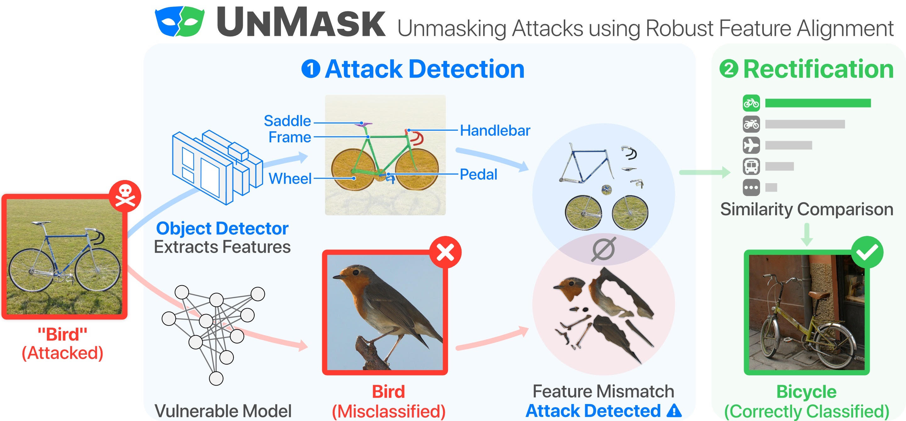

# UnMask: Adversarial Detection and Defense in Deep Learning Through Robust Feature Alignment

## Experiments
### 1.Experiment environment
Intel Core i7-5820K 3.3 GHz 12 cores

Geforce Titan X

64 GByte main memory

Ubuntu 16.04 LTS 64-bit
### 2.Running the code：
#### 2.1.Main steps
a. Install anaconda3
b. Bulid a "data" floder in the main code directory, and put the download dataset 'unmask' into 'data'.

c. Create a virtual Python environment 'unmask-rest'by :
```
conda env create -f environment.yml
```
d. Run the main.py
#### 2.2.Problems and Errors
tensorflow.python.framework.errors_impl.CancelledError: Session has been closed.
May useful links about the description of this error:https://www.gitmemory.com/issue/GoogleCloudPlatform/cloudml-samples/331/501913732

#### 2.3.Updates
This issue can be solved by modifing the session.py of tensorflow.
The path of session.py is mentioned in the exact error.(tensorflow/tensorflow/python/client/session.py)

#### 2.4.solutions
add “and self._session._session is not None: ” in ‘def __del__(self): ’ in the definition of BaseSession._Callable.__del__:


### 3.Running Experiments
There are model K and model M in this project.
### 4.Related works by authors

Extracting Knowledge For Adversarial Detection and Defense in Deep Learning.
https://poloclub.github.io/polochau/papers/19-kdd-unmask.pdf

Another implementation by JPEG Compression.
https://arxiv.org/pdf/1802.06816.pdf

AI-infused security: Robust defense by bridging theory and practice.
https://smartech.gatech.edu/handle/1853/62296

An introduction of Unmask:
https://smartech.gatech.edu/handle/1853/60900

## Improvements
### 1. Data augmentation of model M
### 2. Architecture of model M


## Overview:

To combat adversarial attacks on deep learning models, we developed **UnMask**, 
a knowledge-based adversarial detection and defense framework. 
The core idea behind UnMask is to protect vulnerable deep learning models by verifying that an image's 
predicted class ("bird") contains the expected building blocks (e.g., beak, wings, eyes). 
For example, if an image is classified as "bird", but the extracted building-blocks are 
*wheel*, *seat* and *frame*, we can utilize this information to alert of an potential attack 
and re-classify the image based on it's building blocks. 



Extensive evaluation shows that UnMask (1) *detects* up to 96.75% of attacks, with a false positive rate 
of 9.66% and (2) *defends* the model by correctly classifying up to 93% of adversarial images 
produced by the current strongest attack, Projected Gradient Descent, in the gray-box setting.
In addition, UnMask performs 31.18% better than adversarial training when averaged across 
8 attack vectors. Our proposed method is architecture agnostic and fast.

