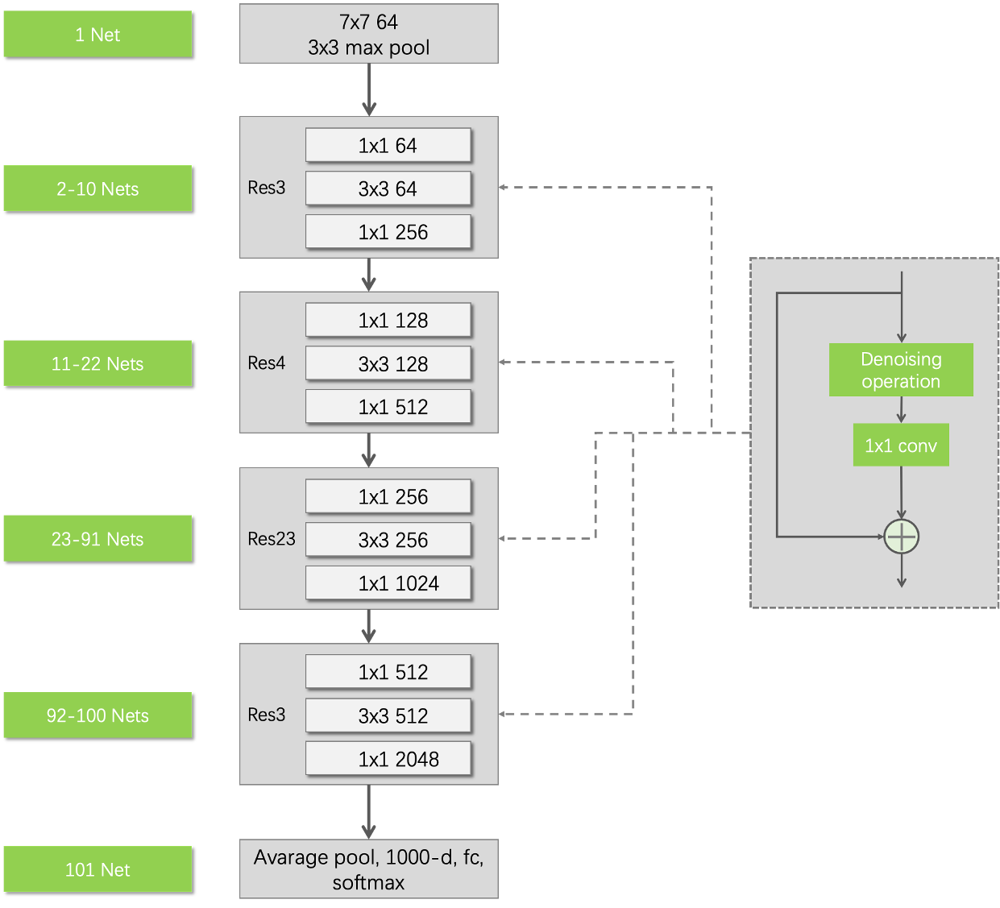
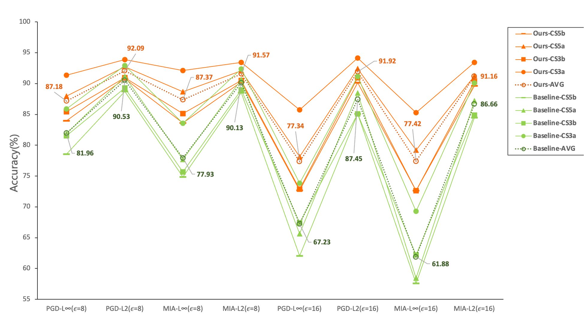

# UnMask: Adversarial Detection and Defense in Deep Learning Through Robust Feature Alignment

## Experiments
### 1.Experiment environment
Intel Core i7-5820K 3.3 GHz 12 cores

Geforce Titan X

64 GByte main memory

Ubuntu 16.04 LTS 64-bit
### 2.Running the code：
#### 2.1.Main steps
A. On a server machine

a. Install anaconda3
b. Bulid a "data" floder in the main code directory, and put the download dataset 'unmask' into 'data'.

c. Create a virtual Python environment 'unmask-rest'by :
```
conda env create -f environment.yml
```
d. Run the main.py

B. Run loaclly
When run the environment.yml file, it will come out some errors of certain packages. These packages should be changed to 'pip' in the yml file. But for hdf5-1.10.4-hb1b8bf9_0 package, it should be installed in the virtual environment seperatlly.
#### 2.2.Problems and Errors
tensorflow.python.framework.errors_impl.CancelledError: Session has been closed.

May useful links about the description of this error:https://www.gitmemory.com/issue/GoogleCloudPlatform/cloudml-samples/331/501913732

#### 2.3.Solutions
This issue can be solved by modifing the session.py of tensorflow.

The path of session.py is mentioned in the exact error.(tensorflow/tensorflow/python/client/session.py)

Solutions:
add “and self._session._session is not None: ” in ‘def __del__(self): ’ in the definition of BaseSession._Callable.__del__:


### 3.Related works by authors

Orignial code: https://github.com/safreita1/unmask

Original paper: https://arxiv.org/pdf/2002.09576.pdf

Version1: 21 Feb 2020

Version2: 14 Nov 2020

Extracting Knowledge For Adversarial Detection and Defense in Deep Learning.
https://poloclub.github.io/polochau/papers/19-kdd-unmask.pdf

Another implementation by JPEG Compression.
https://arxiv.org/pdf/1802.06816.pdf

AI-infused security: Robust defense by bridging theory and practice.
https://smartech.gatech.edu/handle/1853/62296

An introduction of Unmask:
https://smartech.gatech.edu/handle/1853/60900

### 4.Improvements
#### 1. Data augmentation of model M
#### 2. Architecture of model M


#### 3. Results

